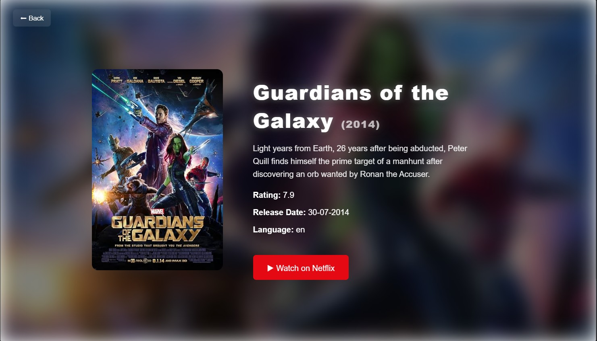

# 🎬 Movie Recommendation System

A Content-Based Movie Recommendation System built using **Python, Flask, Pandas, Scikit-learn, and Machine Learning**. The application recommends movies similar to the one entered by the user using cosine similarity on movie metadata.

---

## 📌 Features

- 🔍 Search for any movie
- 🎯 Get top similar movie recommendations
- ⚡ Fast recommendation generation using cosine similarity
- 🎨 Modern and responsive user interface
- 📱 Easy-to-use web application
- 🖼️ Attractive movie-themed homepage

---

## 🛠️ Tech Stack

### Frontend
- HTML5
- CSS3
- Bootstrap
- JavaScript

### Backend
- Python
- Flask

### Machine Learning
- Pandas
- NumPy
- Scikit-learn
- CountVectorizer
- Cosine Similarity

---

## 📂 Project Structure

```
Movie-Recommendation-System/
│
├── static/
│   ├── css/
│   ├── images/
│   └── js/
│
├── templates/
│   └── index.html
│
├── app.py
├── movies.csv
├── similarity.pkl
├── movie_list.pkl
├── requirements.txt
└── README.md
```

---

## ⚙️ How It Works

1. User enters a movie name.
2. The system searches for the selected movie.
3. Movie features are converted into numerical vectors using **CountVectorizer**.
4. Cosine Similarity calculates similarity scores between movies.
5. The top most similar movies are displayed as recommendations.

---

## 🚀 Installation

### Clone the repository

```bash
git clone https://github.com/your-username/movie-recommendation-system.git
```

Go to the project folder

```bash
cd movie-recommendation-system
```

Install dependencies

```bash
pip install -r requirements.txt
```

Run the Flask application

```bash
python app.py
```

Open your browser and visit

```
http://127.0.0.1:5000/
```

---

## 📊 Machine Learning Algorithm

The recommendation engine is based on:

- Content-Based Filtering
- Count Vectorization
- Cosine Similarity

The system compares movie metadata and recommends movies with the highest similarity scores.

---

## 💻 Libraries Used

- Flask
- Pandas
- NumPy
- Scikit-learn
- Pickle

---

## 📸 Screenshot

## 📸 Project Screenshots

<table align="center">
  <tr>
    <td align="center">
      <b>🏠 Movie Page</b><br><br>
      
    </td>
    <td align="center">
      <b>🔍 Home Page</b><br><br>
      
    </td>
  </tr>

  <tr>
    <td colspan="2" align="center">
      <br>
      <b>🎬 Movie Recommendation Results</b><br><br>
      
    </td>
  </tr>
</table>

---

## 🎯 Future Improvements

- User authentication
- Movie posters using TMDB API
- Movie trailers
- Genre-wise filtering
- Rating prediction
- Collaborative filtering
- Hybrid recommendation system
- Deployment on Render or Railway

---

## 🤝 Contributing

Contributions are welcome!

Feel free to fork the repository, create a new branch, and submit a pull request.

---

## 📜 License

This project is developed for educational purposes.

---

## 👩‍💻 Author

**Prachi R. Patel**
**Aditi Parmar**

If you like this project, don't forget to ⭐ the repository.
